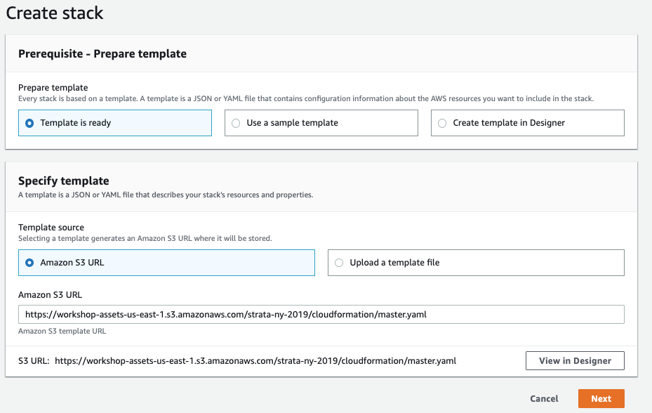
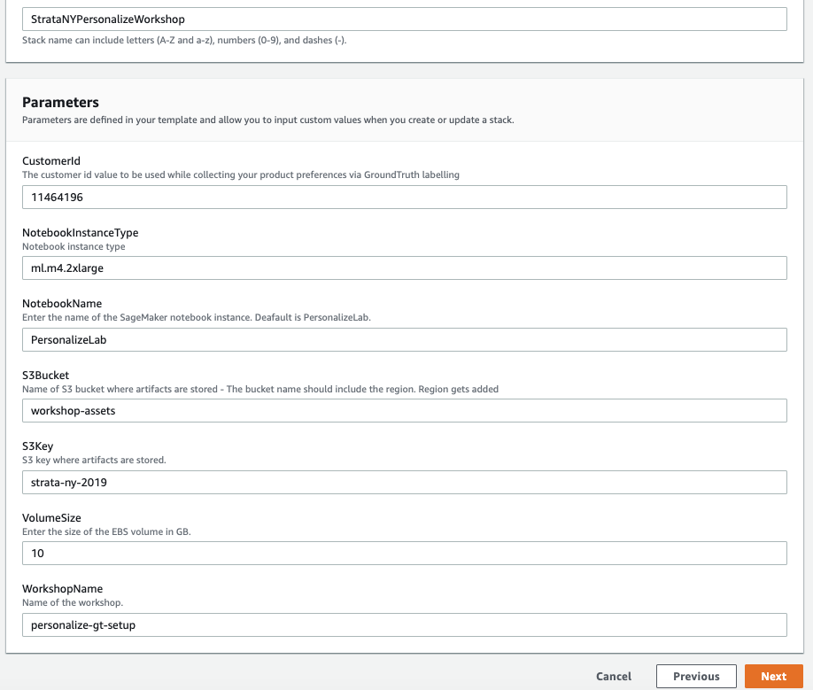
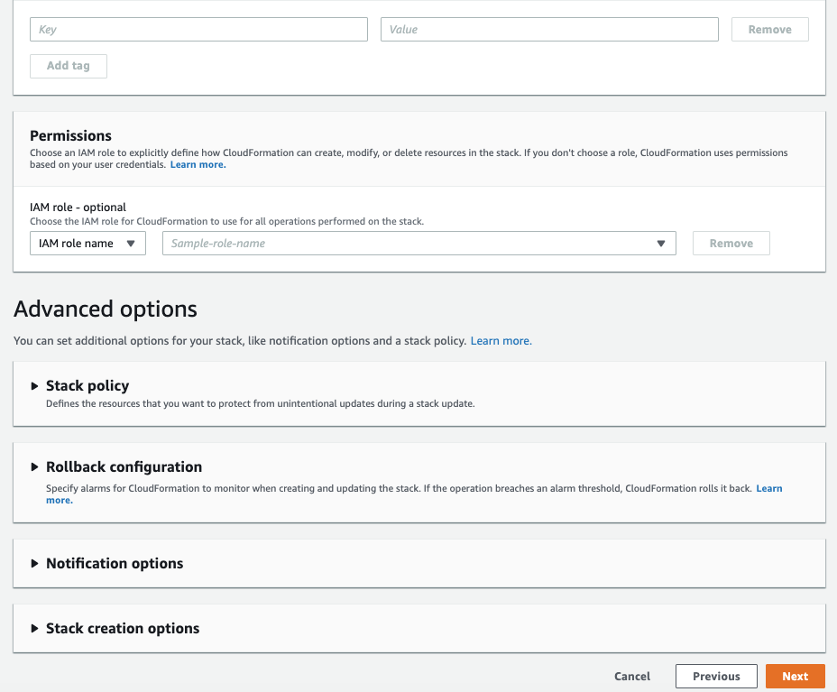
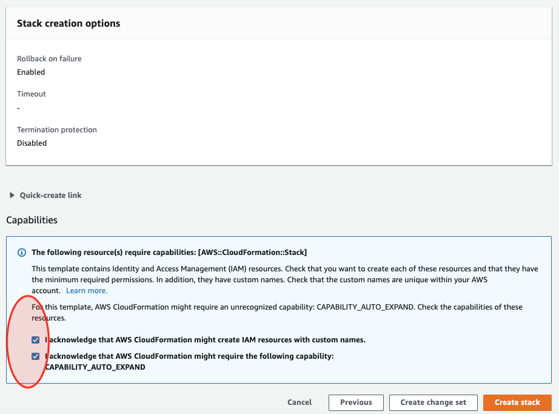
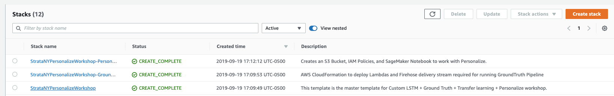

## Building a recommender system with Amazon ML services

In this workshop we # Getting Started

The below steps will walk you through building an environment. If you have any issues with any of the content below please open an issue here in the repository.

## Prerequisites

Only applies if you are deploying with the CloudFormation template, otherwise consult the IAM permissions needed for your specific task.

1. AWS Account
2. User with administrator access to the AWS Account

## Building Your Environment

The first step is to deploy a CloudFormation template that will perform much of the initial setup for you. In another browser window login to your AWS account. Once you have done that open the link below in a new tab to start the process of deploying the items you need via CloudFormation.

Follow along with the screenshots if you have any questions about these steps.

### Cloud Formation Wizard

Start by clicking `Next` at the bottom like shown:

In the next page you need to provide a unique S3 bucket name for your file storage, it is recommended to simply add your first name and last name to the end of the default option as shown below, after that update click `Next` again.

This page is a bit longer so scroll to the bottom to click `Next`.

Again scroll to the bottom, check the box to enable the template to create new IAM resources and then click `Create Stack`.

Once it has completed you'll see green text like below indicating that the work has been completed:

## Agenda

The steps below outline the process of building your own recommendation model, improving it, and then cleaning up all of your resources to prevent any unwanted charges. To get started executing these follow the steps in the next section.

## Using the Notebooks

The rest of the lab will take place via the Jupyter notebooks, simply read each block before executing it and moving onto the next. If you have any questions about how to use the notebooks please ask your instructor or if you are working independently this is a pretty good video to get started:

https://www.youtube.com/watch?v=Gzun8PpyBCo

## After the Notebooks

You'll now notice that the stack is in progress of being deleted. Once you see `Delete Completed` you know that everything has been deleted and you are 100% done with this lab.
